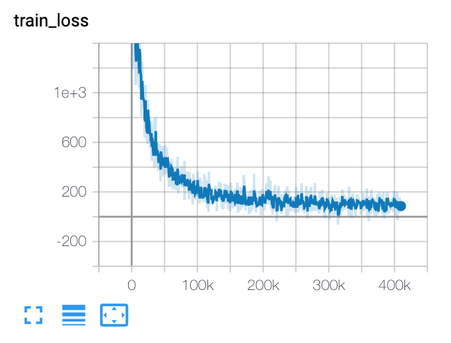
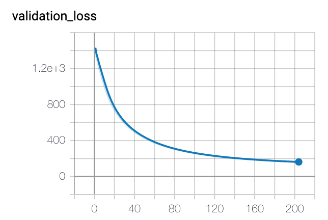

# SummaRunner
## This is my implementation for the famous Extractive Summarizer:
###[SummaRuNNer: A Recurrent Neural Network based Sequence Model for Extractive Summarization of Documents (https://arxiv.org/abs/1611.04230). 

This is the results I get from my implementation on CNN/dailyMail data set at 275 byte. 

| scores | rouge-1 recall | rouge-2 recall | rouge-l recall |
| :------: |:-------------:| :-----:| :-----:|
| lead3     | 43.32 | 19.55 | 35.59|
| SummaRuNNer | 33.86 | 11.55 | 29.85 |

The training loss is as follows:

The validation loss is as follows:

